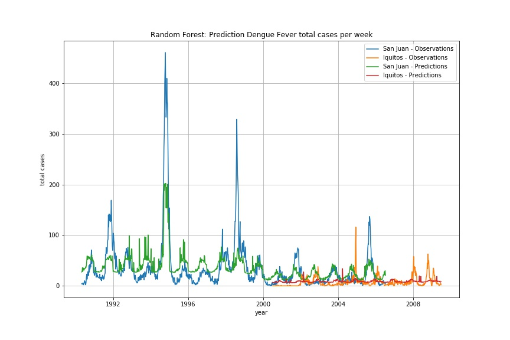

# Projet SD701: Mosquito

*Hélène Danlos, Chloé Younes, Nicolas Louis, Thomas Mensch*


## Introduction

**objectif :** Le but de ce projet est de prédire le nombre de cas hebdomaires de dengue dans deux villes d'Amérique du Sud, San Juan au Puerto Rico et Iquitos au Pérou, à partir d'observations environnementales (e.g, températures, précipitations ...)

La dengue, aussi appelée « grippe tropicale », est une maladie virale transmise à l’homme par des moustiques du genre Aedes.
L’incidence de la dengue progresse actuellement de manière très importante, et l’inscrit aujourd’hui aux rangs des maladies dites «ré-émergentes».
L’OMS estime à 50 millions le nombre de cas annuels, dont 500 000 cas de dengue hémorragique qui sont mortels dans plus de 2,5% des cas.
On estime à deux milliards et demi (2,500,000,000) le nombre de personnes vivant dans des zones à risque.
Initialement présente dans les zones tropicales et subtropicales du monde, la dengue a désormais touché l’Europe où les 2 premiers cas autoch tones ont été recensés en 2010. 
Elle se manifeste le plus souvent par un syndrome grippal (fièvre, douleurs musculaires) et peut évoluer en forme grave avec des complications sévères.

Les facteurs environmentaux (e.g., températures, précipitations humidité ...) jouent un rôle très important dans le développement et la prolifération des moustiques et sont donc des indicateurs précieux dans la prévision des épidémies.

Au regard des enjeux sanitaires que cette menace représente, un challenge, *"DengueAI"*, a été mis en place.
Il récompense les meilleures équipes qui à partir d'un jeu de données arrivent à obtenir le modèle prédictif le plus performant.

Après avoir réalisé quelques recherches sur les travaux existants/antérieurs, l'originalité de notre approche réside principalement dans l'utilisation de *Spark* pour le traitement de ces données.
En effet dans ce projet, il s'agit d'étudier des séries temporelles et nous avons pu constater que les bibliothèques de base de *Spark* était peut adaptées à ce type de problème.

La performance de nos modèles est évaluée en fonction de la MAE (*Mean Absolute Error*) obtenue sur le jeu de données *test* fourni par le challenge *"DengueAI"*.

Pour ce projet, nous avons réalisé plusieurs *notebooks*, organisés de la manière suivante :
 1. préparation des données
 2. construction d'un premier modèle de prédiction
 3. analyse et exploration des données
 4. amélioration du modèle par *"feature engineering"*
 5. amélioration de la cross validation pour les time-series par fenêtre glissante des K-folds.

**Résultats obtenus** - Nous avons obtenu des résultats honorables sur *DengueAI* en arrivant dans le **TOP 20%** des 7983 contributeurs avec un MAE de 26.1755.


## Description des données

Les données sont disponibles sur le site suivant:
[DengAI: Predicting Disease Spread](https://www.drivendata.org/competitions/44/dengai-predicting-disease-spread/)

Le jeu de données est constitué de séries temporelles échantillonnées à la semaine et réparti en deux fichiers:

 - `data/dengue_features_train.csv` contenant les variables explicatives,
 - `data/dengue_labels_train.csv` contenant la variable à expliquer.


### Variables explicatives : `dengue_features_train.csv`

Le fichier contient 1456 lignes x 24 colonnes.
Les variables explicatives sont de différentes natures: géographiques, temporelles, environnementales (températures, plages de température, précipitations, taux d'humidité, indice de végétation). Elles sont décrites ci-dessous :

*Villes et dates*

 - `city` – abbréviations des villes : `sj` pour San Juan (Puerto Rico) et `iq` pour Iquitos (Pérou)
 - `year` – année de l'enregistrement
 - `weekofyear` – semaine de l'enregistrement
 - `week_start_date` – date de l'enregistrement des données au format `yyyy-mm-dd`

*Les mesures quotidiennes de la station météorologique GHCN de la NOAA*

 - `station_max_temp_c` – température Maximum (en degré *Celsius*)
 - `station_min_temp_c` – température Minimum (en degré *Celsius*)
 - `station_avg_temp_c` – température Moyenne (en degré *Celsius*)
 - `station_precip_mm` – total des précipitations (en *mm*)
 - `station_diur_temp_rng_c` – plage de températures diurnes (en degré *Celsius*)
 
*PERSIANN satellite precipitation measurements (Echelle de 0.25 x 0.25 degrés)*

 - `precipitation_amt_mm` – total des précipitations (en *mm*)

*Mesures de réanalyse du système de prévisions climatiques NCEP de la NOAA (échelle de 0.5 x 0.5 degrés)*

 - `reanalysis_sat_precip_amt_mm` – total précipitation (en *mm*)
 - `reanalysis_dew_point_temp_k` – température moyenne du point de rosée (en *kelvin*)
 - `reanalysis_air_temp_k` – température moyenne de l'air  (en *kelvin*)
 - `reanalysis_relative_humidity_percent` – humidité relative moyenne
 - `reanalysis_specific_humidity_g_per_kg` – humidité spécifique moyenne
 - `reanalysis_precip_amt_kg_per_m2` – précipitations totale (en *mm*)
 - `reanalysis_max_air_temp_k` – température de l'air maximum (en *kelvin*)
 - `reanalysis_min_air_temp_k` – température de l'air minimum (en *kelvin*)
 - `reanalysis_avg_temp_k` – température moyenne de l'air (en *kelvin*)
 - `reanalysis_tdtr_k` – plage des températures diurnes (en *kelvin*)

*Relevé de végétation satellitaire - Indice de végétation par différence normalisée (NDVI) - Mesures de l'indice de végétation par différence normalisée du CDR de la NOAA (échelle de 0.5 x 0.5 degré)*

 - `ndvi_se` – niveau de végétation au sud est de la ville
 - `ndvi_sw` – niveau de végétation au sud ouest de la ville
 - `ndvi_ne` – niveau de végétation au nord est de la ville
 - `ndvi_nw` – niveau de végétation au nord ouest de la ville


### Variable à expliquer : `dengue_labels_train.csv`

Le fichier contient 1456 lignes x 4 colonnes. La variable à expliquer est:

 - `total_cases` – nombre de cas hebdomadaires de dengue par ville

Les 3 autres variables `city`, `year` et `weekofyear` permettent d'associer la variable à expliquer aux covariables. 


## Traitement des données


### Prépararation des données (`11-SD701_Dengue_Preprocessing.ipynb`)

Nous avons préparé les données en appliquant les traitements suivants :

 - *recast* de certaines colonnes de chaines de caractères en *float*, *int*, *date*
 - suppression des colonnes redondantes
 - remplissage des données manquantes par celles immédiatement précédentes. Dans notre cas, nous ne souhaitons pas supprimer les lignes comportant des observations non définies (*NaN*) car :
    1. nous disposons de peu de données, il faut donc les préserver,
    2. nous manipulons des séries temporelles, il faut éviter de "casser" la séquence d'observations.
 - homogénéisation des unités de température.

Les données pre-traitées sont sauvegardées en format `parquet` sur disque.

D'autre part, nous chargeons le jeu de données de test (i.e., sans label correspondant), fournies par le "Challenge *DengueAI*", sur lequel nous appliquons les mêmes transformations et que nous sauvegardons aussi au format `parquet'.


### Construction d'un premier modèle de prédiction (`12-SD701_Dengue_FirstModel.ipynb`)

Dans ce *notebook*, nous construisons un modèle prédictif avec l'ensemble des variables en utilisant un algorithme de *Random Forest*.

**Jeu d'entrainement et jeu de test** - La première étape consiste à séparer les données afin de construire un jeu de données d'entrainement et un jeu de données de test (*split*).
Comme nous travaillons avec des séries temporelles, nous ne pouvons pas utiliser la fonction standard `randomSplit`  de la bibliothèque `sql` de *Spark*.
Nous construisons le jeu de données *test* (10 % des données), pour chaque ville, avec les données les plus récentes afin de préserver la séquence temporelle. Plus précisément, nous conservons pour le jeu de test les 93 dernières semaines d'observations de San Juan et les 52 dernière semaines pour Iquitos.

**_Pipeline_** - Ensuite nous construisons un *pipeline* afin de transformer les données dans une forme utilisable par l'algorithme de forêt aléatoire. Les transformations consistent en un *HotEncoder* pour les variable de type *string* (`city`) et en une normalisation des données.

**_Random forest_** - L'algorithme de *random forest*, utilisant les paramètres par défaut (`maxDepth=5` et `numTrees=20`), donne une MAE de `14.610`.
ATTENTION les résultats varient d'une expérience à l'autre, le valeur de MAE est indicative.

**Ajustement des hyper-paramètres** (*grid search*) - là encore, nous ne pouvons pas utiliser les outils disponibles dans *Spark* du fait du caractère temporel des données.
Nous avons donc implémenté notre propre *grid search* pour deux hyper-paramètres des forêts aléatoires: le nombre d'arbres constituant la forêt et la profondeur maximum de chaque arbre.
Nous sommes conscients de l'aspect "simpliste" de notre mise en oeuvre de la *grid search*.
Après *grid search*, nous obtenons une MAE de `12.873`.

**Visualisation** - La visualisation des predictions su le jeu d'entrainement) montre que le modèle peine à retrouver la complexité de la série temporelle. Nous remarquons toutefois que visuellement le modèle retrouve la périodicité 




### Analyse et exploration des données (`13-SD701_Dengue_CrossCorrelation.ipynb`)

Ce notebook nous permet d'identifier les variables (*features*) les plus pertinentes pour améliorer notre modèle précédent, à l'aide de l'analyse des matrices de corrélation.

Notamment les différences notables entre les matrices de corrélation de chaque ville suggère de  construire un modèle de prédiction séparé pour chaque ville.


### *Feature engineering*  (`14-SD701_Dengue_FeatureEngineering-1.ipynb` et `15-SD701_Dengue_FeatureEngineering-2.ipynb`)

Dans ces 2 notebooks, nous essayons d'améliorer le modèle en travaillant sur certaines variables.
Tout d'abord, sur les variables liées à la végétation (*ndvi*):

 - seuillage de la densité de végétation. Comparativement au paludisme, la dengue est davantage présente dans les villes alors que le paludisme est plutôt en zone rurale. A travers ce seuillage, nous avons cherché à mettre en évidence ce facteur.
 - moyennage de la densité de végétation.
 
 - ajout de nouvelles features : prise en compte des valeurs des semaines précédentes. En faisant du benchmarking et en s'appuyant sur le cycle habituel de vie du moustique et des périodes d'incubation, nous nous sommes rendus compte qu'un pas de 3 semaines était le plus efficace.

```
shift=0, Best model (numTree=50, MaxDepth=3) => MAE = 12.797
shift=1,
shift=2, Best model (numTree=55, MaxDepth=3) => MAE = 12.486
shift=3, Best model (numTree=50, MaxDepth=4) => MAE = 12.465
shift=4, Best model (numTree=30, MaxDepth=3) => MAE = 12.544
```

### *Custom Cross Validation* par fenêtres glissantes des K-folds (`16-SD701_Dengue_CustomCrossVal.ipynb`)

Après avoir amélioré les variables les plus pertinentes dans les notebook précédents, nous nous sommes attachés à améliorer le processus de cross validation. En effet, classiquement ce dernier s'effectue en créant des K folds de manière aléatoire sans se préoccuper du côté temporel des échantillons créés. Après avoir effectué du benchmarking sur ce point précis et faute de librairies dédiées dans Spark, nous nous sommes inspirés du code fourni sur le site https://www.timlrx.com/2018/04/08/creating-a-custom-cross-validation-function-in-pyspark/ pour prendre en compte le côté temporel des données et renforcer l'apprentissage du modèle à travers les ans.

 Pour cela, nous avons créé la class CustomCrossValidator en créant par exemple pour San Juan (où nous avons des données de 1990 à 2008) des K fold comme suit, avec des pas de 3 ans :
- train 1990-1993 test 1993-1996
- train 1990-1996 test 1996-1999
- train 1990-1999 test 1999-2002
- train 1990-2002 test 2002-2005
- train 1990-2005 test 2005-2008

Puis nous lançons notre modèle de Random Forest avec une cross validation sur ces K fold et obtenons encore de meilleurs résultats que précédemment.


## Conclusion

Les résultats obtenus sont des résultats honorables sur *DengueAI*.

La principale difficulté rencontrée réside dans l'utilisation de *Spark* pour le traitement des séries temporelles.

Nous avons donc dû implémenter nos propres fonctions de *"split"* et de *"grid search"*.

Nous avons considéré 1 modèle de prédiction unique pour les deux villes, avec comme objectif d'obtenir un modèle "universel". Sans doute qu'un modèle ajusté/dédié pour chaque ville serait certainement plus performant.

